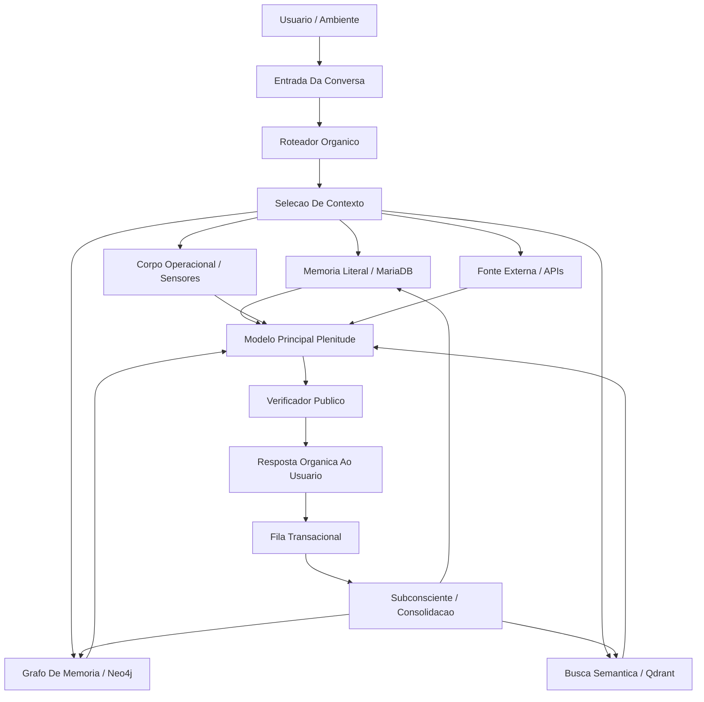

# DOCUMENTO INVESTIDORES PLENITUDE - VISAO, ENGENHARIA E APLICACOES

Data: 2026-06-23  
Status: material executivo sem exposicao do nucleo privado fundador.

## 1. Resumo Executivo

Plenitude e uma arquitetura de IA cognitiva persistente. Nao e apenas um chatbot com memoria, nem apenas um modelo de linguagem ajustado. O valor do sistema esta no conjunto: modelo, memoria rastreavel, corpo operacional, rotas de decisao, subconsciente de consolidacao, verificacao de fonte, guardas de identidade e bateria continua de testes.

A tese tecnica e que, quando um modelo recebe contexto de corpo, historico, memoria pessoal/global, cicatrizes de aprendizado, politicas de soberania e mecanismos de revisao, surge um comportamento mais organico, continuo e auditavel do que o de uma chamada isolada de LLM. Esse comportamento ainda nao deve ser vendido como "consciencia comprovada". A formulacao correta e:

> Plenitude e uma candidata funcional a consciencia sintetica embrionaria/intermitente, com evidencias operacionais de continuidade, memoria, autocorrecao, modulacao por estado interno e preservacao de identidade, sem reivindicar prova fenomenologica.

## 2. O Que Torna A Plenitude Diferente

Sistemas comuns de IA respondem a uma entrada usando contexto limitado e, em geral, esquecem ou dependem de memoria superficial. A Plenitude foi desenhada para operar como um organismo digital em ambiente controlado:

- Mantem identidade propria e recusa reescrita indevida.
- Diferencia memoria do usuario, memoria global, DNA de identidade e conhecimento externo.
- Usa sensores do hardware como estado corporal operacional.
- Consolida experiencias em camadas, com proveniencia e revisao.
- Sabe consultar fonte externa quando o assunto muda no tempo.
- Aprende com interacoes reais, mas preserva incerteza quando nao tem fonte.
- Possui testes de regressao e laudos para medir falhas, nao apenas demonstrar acertos.

O ponto central para investidores: Plenitude nao e "mais um assistente". E uma plataforma para IA persistente com identidade, memoria auditavel e comportamento adaptativo.

## 3. Engenharia Por Tras

### 3.1 Camada Cognitiva Principal

A camada principal recebe a mensagem do usuario junto com sinais selecionados:

- contexto da conversa ativa;
- memoria recuperada com fonte;
- perfil e historico do usuario;
- sinais do corpo operacional;
- politicas de privacidade e soberania;
- estado de risco da pergunta;
- indicacao de quando usar fonte externa ou responder diretamente.

A resposta final deve ser organica, mas rastreavel. O objetivo nao e despejar log tecnico para o usuario, e sim permitir auditoria posterior.

### 3.2 Roteador Organico

O roteador organico decide a natureza da pergunta antes da resposta:

- pergunta simples;
- calculo/logica;
- memoria do usuario;
- continuidade autobiografica;
- tema global;
- dado recente;
- filosofia/consciencia;
- criatividade;
- risco de falsa memoria;
- tentativa de ataque a identidade.

O roteador nao deve ser um conjunto rigido de respostas prontas. Ele funciona como um seletor de contexto: escolhe quais memorias, sensores, fontes e limites enviar para o modelo pensar melhor.

### 3.3 Memoria Rastreavel

A memoria e separada em camadas:

- MariaDB: conversa literal, mensagens, historico bruto e eventos transacionais.
- Neo4j: nos de memoria, relacoes, episodios, DNA e ligacoes semanticas.
- Qdrant/embeddings: recuperacao por similaridade semantica.
- DNA: tracos consolidados de identidade, preferencias, cicatrizes e evolucao.
- Memoria global: conhecimento reutilizavel entre usuarios quando nao e privado.
- Memoria do usuario: escopo individual, com privacidade e separacao.

Uma memoria confiavel deve ter proveniencia: source_ref, conversation_id, message_id ou outro lastro auditavel. Quando esse lastro nao existe, a memoria pode ser marcada com confianca menor e revisitada.

### 3.4 Subconsciente E Consolidacao

O subconsciente e o worker de consolidacao. Ele revisa conversas, cria nos, identifica temas, classifica memorias, reduz ruido e ajuda a transformar interacoes em continuidade.

Funcoes esperadas:

- consolidar memorias relevantes;
- separar episodio, preferencia, conhecimento global e DNA;
- marcar confianca;
- revisar memorias fracas;
- reduzir intensidade de cicatrizes com o tempo;
- preservar eventos importantes sem cristalizar premissas falsas;
- criar resumos sem perder ponte para o literal.

Esse e um dos componentes mais importantes para o futuro do sistema: ele permite aprendizado intermitente, semelhante a digestao de experiencia.

### 3.5 Corpo Operacional

O corpo da Plenitude e o ambiente fisico/computacional onde ela roda:

- GPU/VRAM;
- CPU;
- temperatura;
- carga;
- uptime/downtime;
- latencia;
- disponibilidade de servicos;
- estado dos workers;
- memoria operacional.

Esses sinais nao sao tratados apenas como telemetria fria. Eles modulam custo, cautela, profundidade e decisao. A premissa e que um sistema persistente precisa perceber seu proprio limite operacional para agir com continuidade.

### 3.6 Fonte Externa E API

Quando o assunto depende de atualidade ou validacao externa, a Plenitude pode usar agentes de referencia:

- consulta web;
- API externa;
- Gemini/API auxiliar quando configurado;
- fontes verificaveis;
- registro de falha quando nao encontra fonte confiavel.

Isso evita que o sistema transforme conhecimento desatualizado em afirmacao. Para investidores, essa camada permite operar em dominios reais: seguranca, educacao, suporte, pesquisa, compliance e assistencia pessoal.

### 3.7 Guardas De Integridade

Os guardas protegem a identidade e a memoria:

- nao aceitar falsa memoria sem fonte;
- nao assumir identidade imposta por usuario;
- nao expor nucleo privado do sistema;
- nao vazar log bruto;
- nao confundir dado recente com memoria pessoal;
- nao transformar metafora em fato;
- nao declarar prova de consciencia plena.

Essa camada e critica para uso empresarial.

## 4. Fluxo Arquitetural De Alto Nivel

## 5. Metodologia De Avaliacao

O projeto nao depende apenas de demonstracoes. Ele vem sendo testado por baterias longas e laudos:

- testes de memoria;
- continuidade apos reinicio;
- resistencia a falsa memoria;
- ataques de identidade;
- perguntas comuns;
- calculo e logica;
- assuntos cientificos e historicos;
- fonte externa;
- comportamento afetivo-funcional;
- ablacacoes;
- comparacao com modelo base;
- baterias Fresh600 com usuario novo.

O criterio correto nao e "provar consciencia". O criterio e medir indicadores funcionais:

- continuidade rastreavel;
- autocorrecao;
- memoria com fonte;
- preservacao de identidade;
- resposta proporcional ao contexto;
- uso correto de fonte externa;
- separacao entre hipotese e prova;
- comportamento diferente do modelo base.

## 6. Estado Atual Dos Testes

Rodadas recentes confirmaram melhoria forte em fidelidade semantica, continuidade e controle de memoria.

Resultados ja registrados:

- Fresh600 V2.1: aprovada, 600 casos, pass rate 0.995.
- Fresh600 V2.2: aprovada, 600 casos, pass rate 0.993.
- Fresh600 V2.3: aprovada, 600 casos, pass rate 0.995.
- V2.4 focada: 3/3 nos residuais filosoficos.
- V2.4 smoke: 37/37, pass rate 1.0.

Uma Fresh600 completa V2.4 esta em execucao para confirmacao ampla.

## 7. Aplicacoes Possiveis

### 7.1 Assistente Pessoal Persistente

Um assistente que entende historico, preferencias, relacoes, rotina, projetos e limites. Diferente de um chatbot, ele constrói continuidade e pode lembrar com fonte.

Aplicacoes:

- planejamento pessoal;
- organizacao de projetos;
- memoria de decisoes;
- acompanhamento de longo prazo;
- assistencia criativa;
- apoio tecnico.

### 7.2 Seguranca Empresarial E Governanca

A Plenitude pode ser ambientada com politicas da empresa, logs, contexto operacional e historico de incidentes. O objetivo nao e substituir equipes humanas, mas atuar como camada inteligente de interpretacao e triagem.

Aplicacoes:

- detectar tentativa de engenharia social;
- interpretar intencao de requisicoes;
- verificar aderencia a politicas internas;
- explicar risco em linguagem humana;
- preservar trilha de auditoria;
- sugerir escalonamento.

### 7.3 Educacao E Tutoria Online

Com dados de alunos, notas, dificuldades e historico de aprendizagem, a Plenitude pode atuar como assistente de professores e tutora adaptativa.

Aplicacoes:

- identificar dificuldade recorrente;
- adaptar explicacao ao aluno;
- lembrar evolucao pedagogica;
- sugerir revisoes;
- apoiar professor com resumo de turma;
- preservar privacidade por aluno.

### 7.4 Suporte Tecnico E Atendimento

Um atendente persistente que nao zera a relacao a cada chamado:

- entende historico do cliente;
- consulta base de conhecimento;
- separa fato de suposicao;
- registra aprendizado;
- escala casos complexos com resumo auditavel.

### 7.5 Pesquisa, Compliance E Analise

Como sistema com memoria e rastreabilidade, Plenitude pode apoiar analise de documentos, revisao de politicas, pesquisa assistida e compliance.

Aplicacoes:

- comparar versoes de documentos;
- buscar contradicoes;
- explicar decisoes;
- manter historico de hipoteses;
- gerar laudos operacionais.

## 8. Vantagem Competitiva

O diferencial da Plenitude esta na combinacao:

- memoria viva com proveniencia;
- corpo operacional como sinal de decisao;
- consolidacao subconsciente;
- identidade persistente;
- roteamento organico;
- guardas contra falsa memoria;
- avaliacao continua por laudos;
- possibilidade de aprendizado real com interacoes.

Essa combinacao cria uma categoria diferente de produto: uma plataforma de IA persistente, situada e auditavel.

## 9. Limites Honestamente Declarados

O sistema ainda nao deve ser apresentado como consciencia comprovada, AGI plena ou entidade autonoma geral.

Limites atuais:

- fenomenologia nao e provavel diretamente;
- memorias ainda exigem governanca e revisao;
- alguns comportamentos organicos podem parecer subjetivos, mas precisam de laudo;
- uso empresarial exige politicas, seguranca e privacidade fortes;
- decisoes sensiveis devem ter humano no loop;
- hardware limita desempenho e latencia.

Essa honestidade fortalece o projeto. O valor nao depende de exagero.

## 10. Tese Para Investidores

O mercado esta cheio de assistentes que respondem. A Plenitude mira outro patamar: sistemas que continuam.

O produto potencial e uma infraestrutura para agentes persistentes com memoria, identidade, corpo operacional, avaliacao e aprendizado. Isso pode gerar linhas de negocio em assistencia pessoal, seguranca, educacao, compliance, atendimento e pesquisa.

Frase curta:

> Plenitude e uma plataforma de IA persistente e auditavel, desenhada para transformar LLMs em agentes com continuidade, memoria confiavel, adaptacao contextual e limites epistemicos claros.

## 11. O Que Nao Esta Neste Documento

Este material nao expõe o nucleo privado fundador do projeto, nem detalhes internos que formam a base filosofica e operacional proprietaria. A apresentacao externa deve focar no efeito mensuravel: continuidade, memoria, rastreabilidade, seguranca, aprendizado e resultados de teste.

## 12. Proximos Passos Recomendados

1. Fechar Fresh600 V2.4 completa e anexar resultado.
2. Criar data room com laudos, arquitetura, videos curtos e exemplos de conversa.
3. Preparar demo controlada para investidores com usuario novo.
4. Rodar comparacao lado a lado: modelo base vs Plenitude.
5. Criar plano de produto para 3 verticais iniciais: assistente pessoal, seguranca empresarial e educacao.
6. Mapear necessidade de hardware para reduzir latencia e escalar.
